# Assignment 1

Questions are on:

1. Linear Regression
2. Sampling, Closed Form and Stochastic Gradient Descent
3. Logistic Regression
4. Gaussian Discriminant Analysis   

## Results

### Linear Regression

  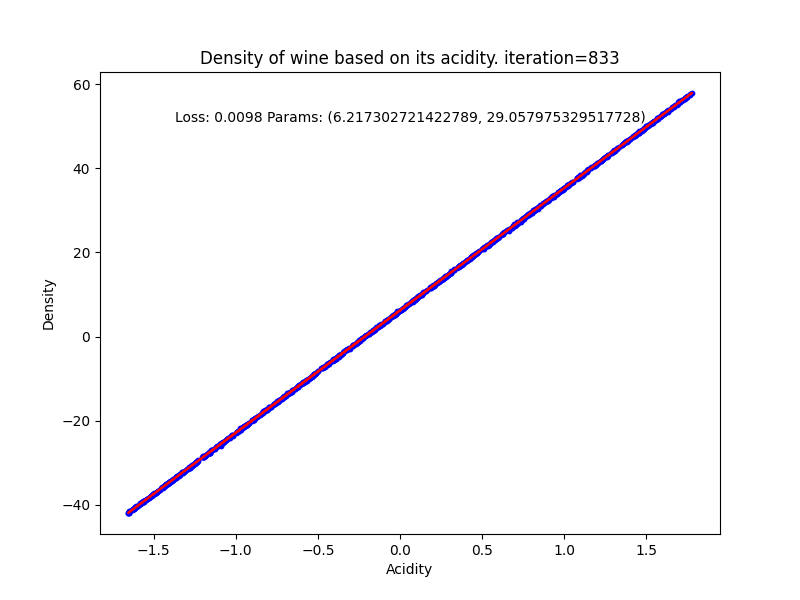

<b>Figure 1:</b> Linear Regression Fit for Learning Rate 0.01

  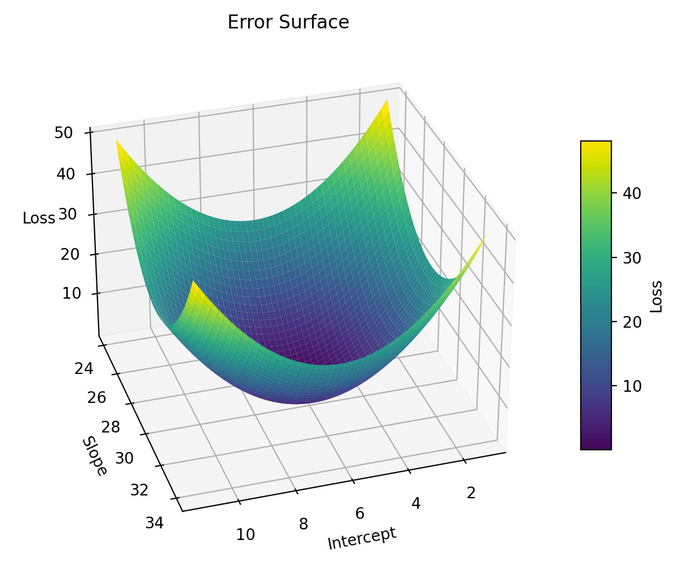

<b>Figure 2:</b> 3-dimensional mesh showing the error function J(θ) on z axis and the parameters in the xy plane.

  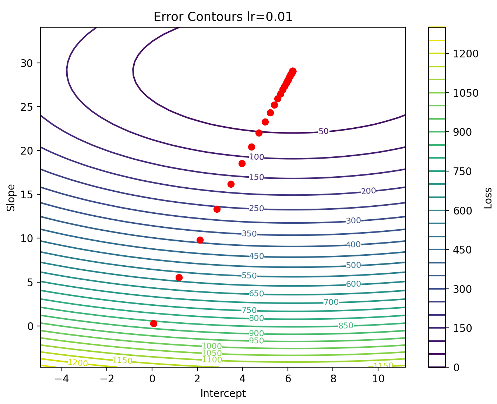

<b>Figure 3:</b> Contour plot showing the error function J(θ) with the path taken by gradient descent for learning rate 0.01 shown in orange.

  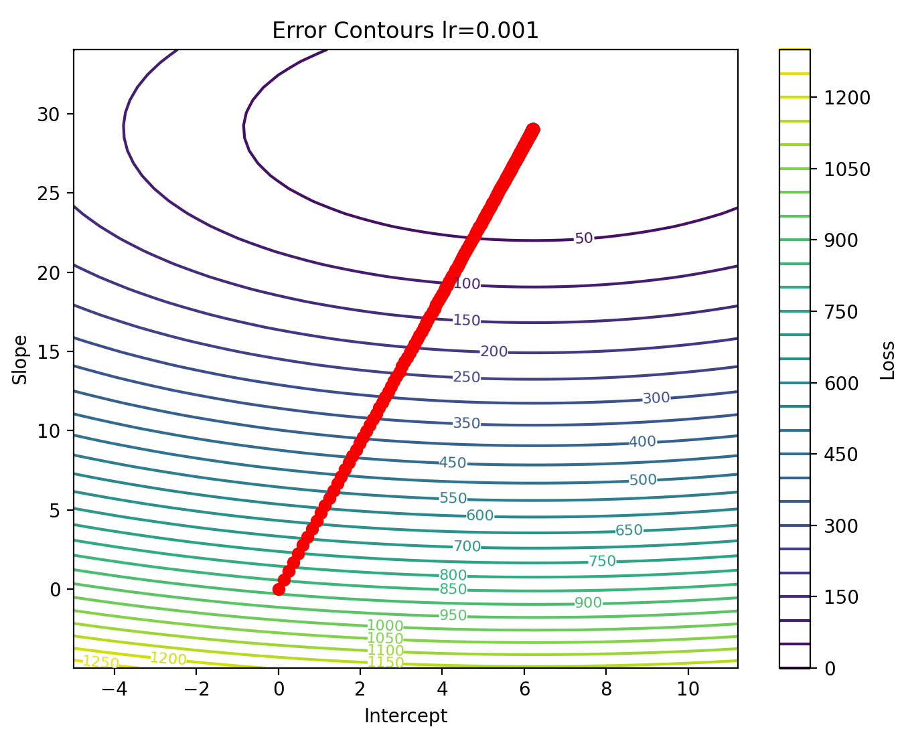
  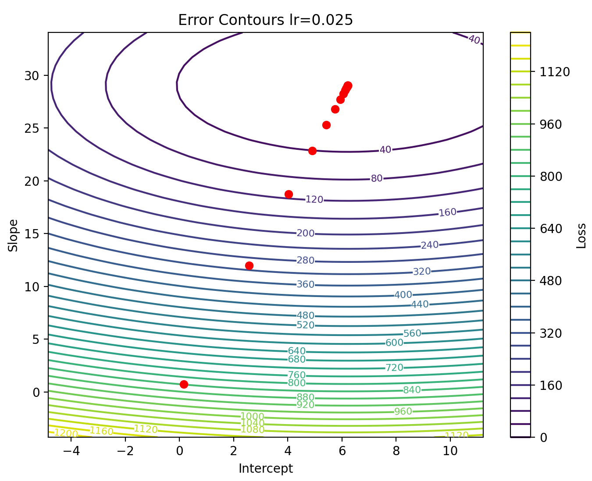
  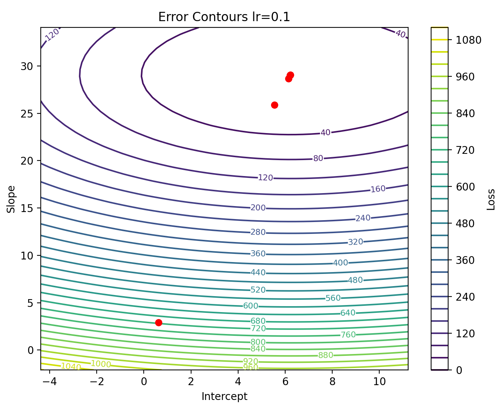

<b>Figure 4:</b> Linear Regression using Stochastic Gradient Descent for learning rates 0.001, 0.01 and 0.1 respectively.

### Sampling, Closed Form and Stochastic Gradient Descent

  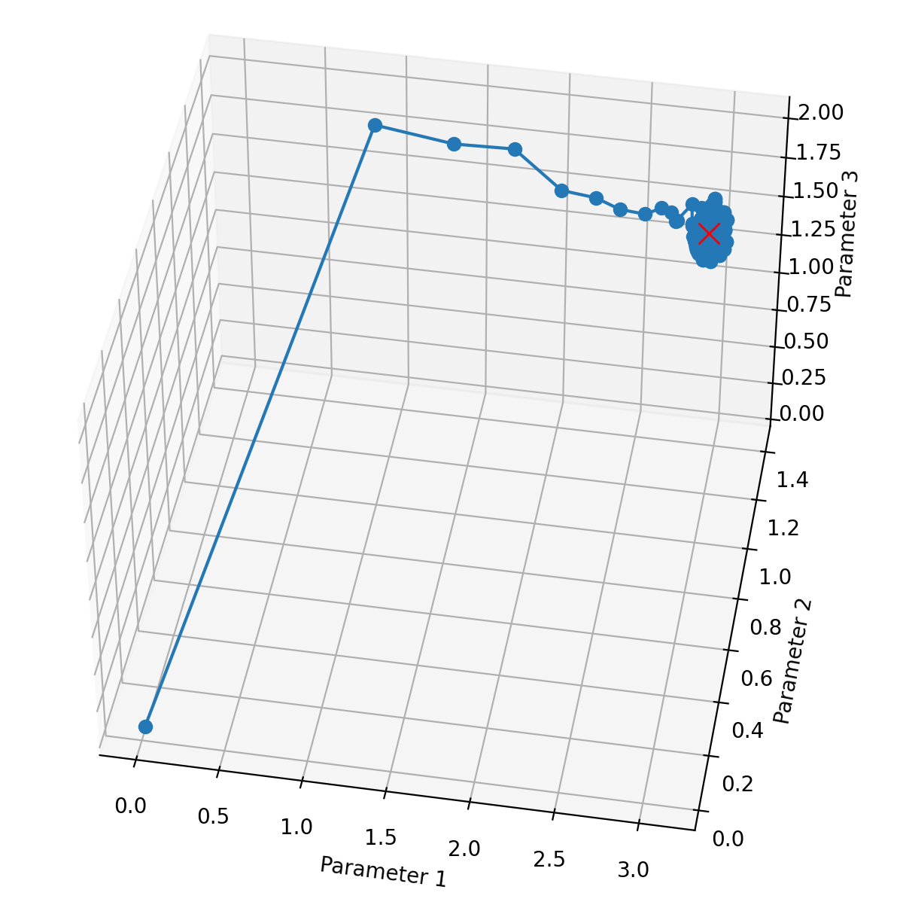
  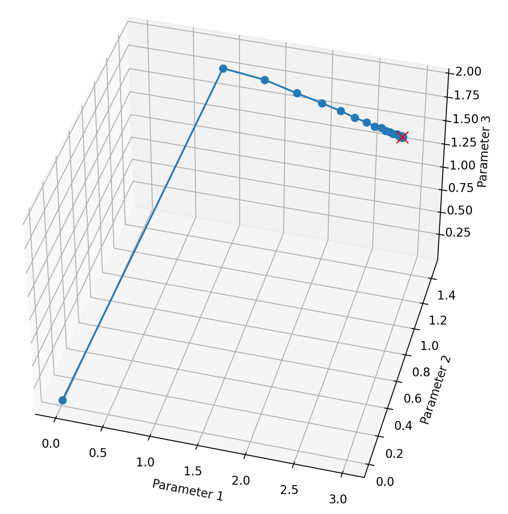
  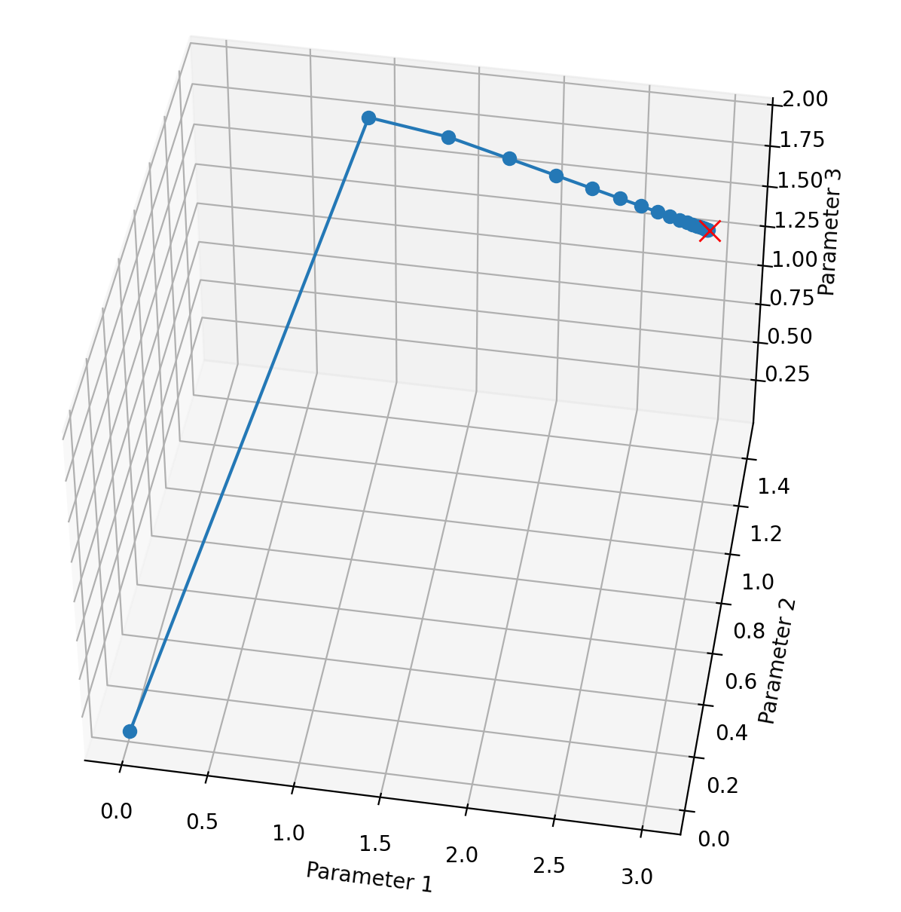
  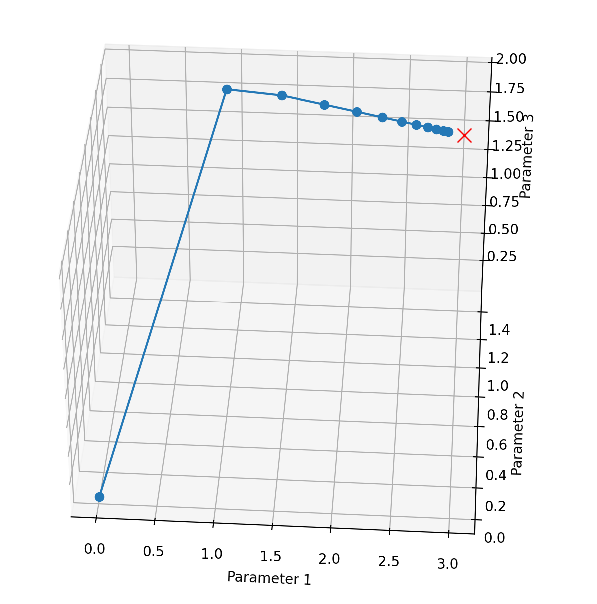

<b>Figure 5:</b> Trajectory of parameters for different batch sizes.

### Logistic Regression

  

<b>Figure 6:</b> Results of Newtons method for logistic regression

### Gaussian Discriminant Analysis

  
    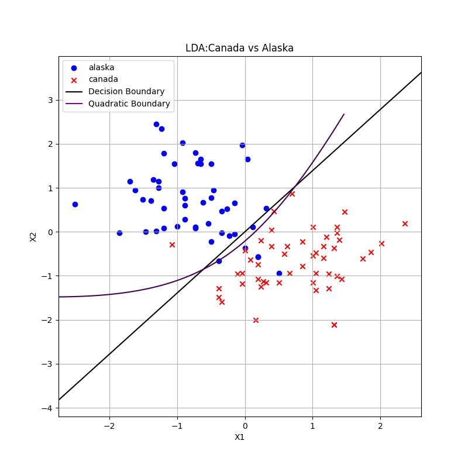    

<b>Figure 7:</b> Results of Gaussian Discriminant Analysis

