# Assignment 3

Questions are on:

1. Decision Trees (and Random Forests)
2. Neural Networks 

## Results

###  Decision Trees (and Random Forests)

  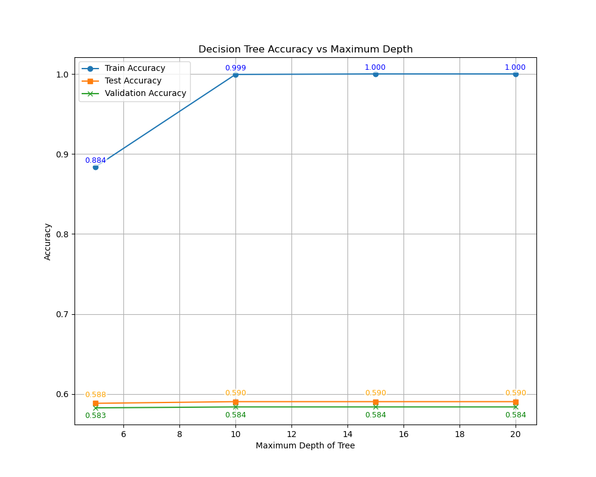
  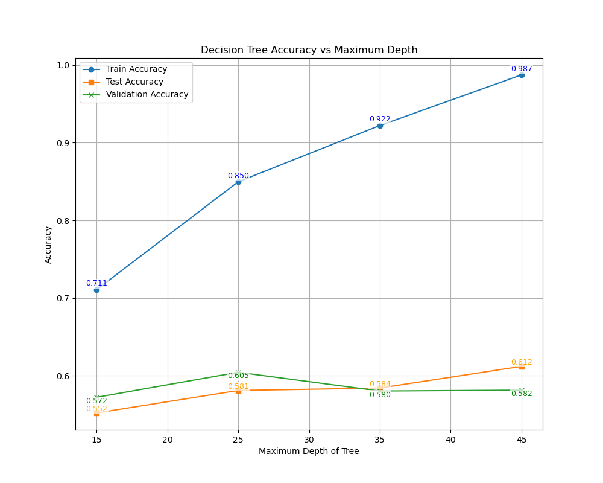

<b>Figure 1:</b> Accuracy vs max depth: with(right) and without(left) one hot encoding. 

  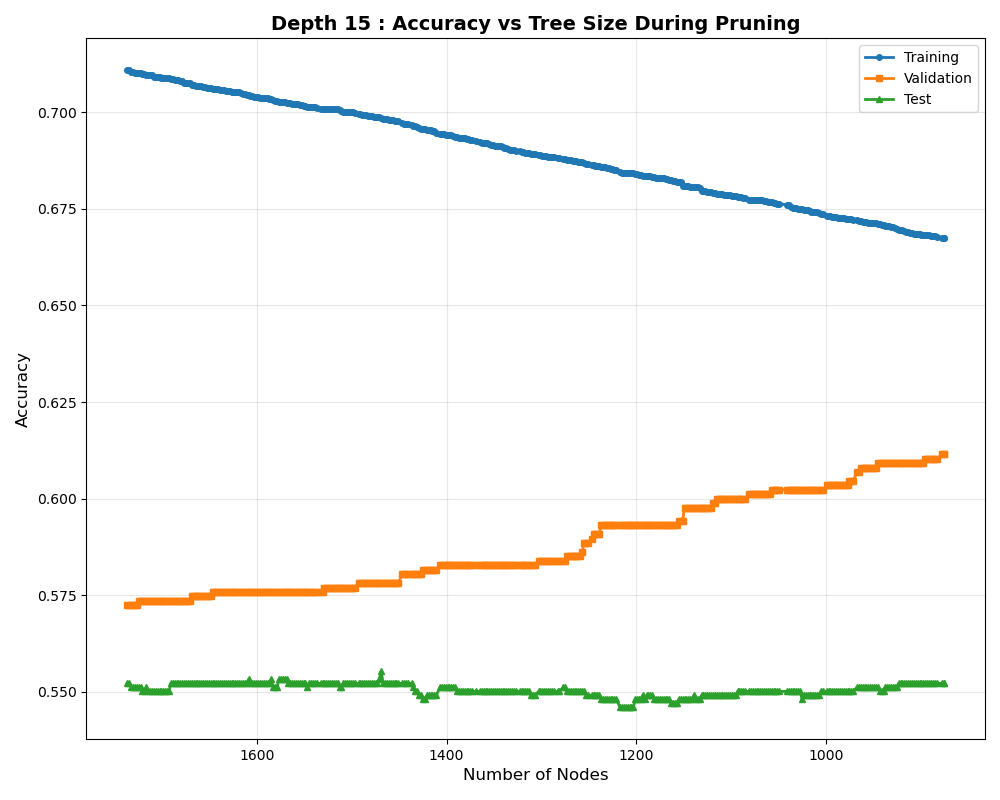
  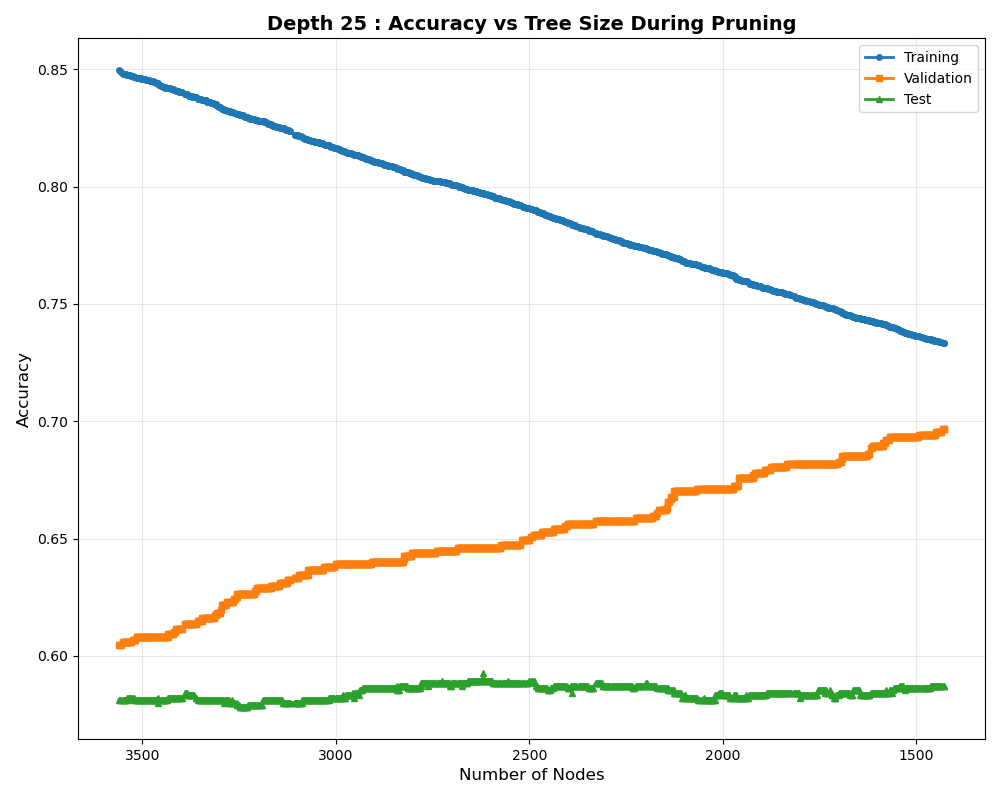
  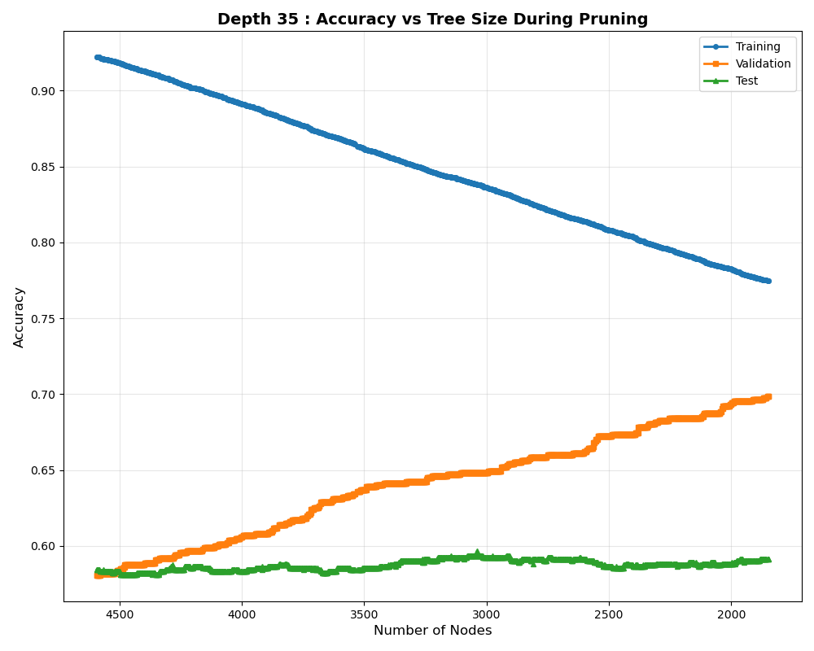
  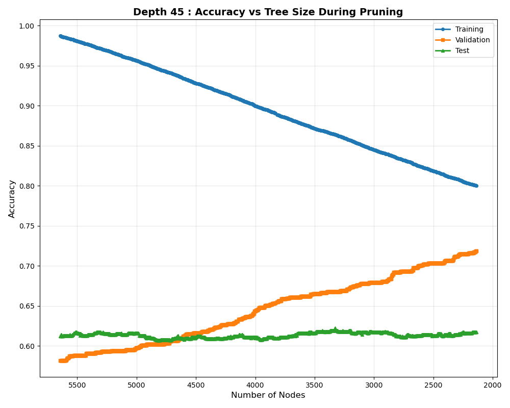

<b>Figure 2:</b> Training, validation, and test set accuracies against the number of nodes while successively pruning for different maximum depths.

  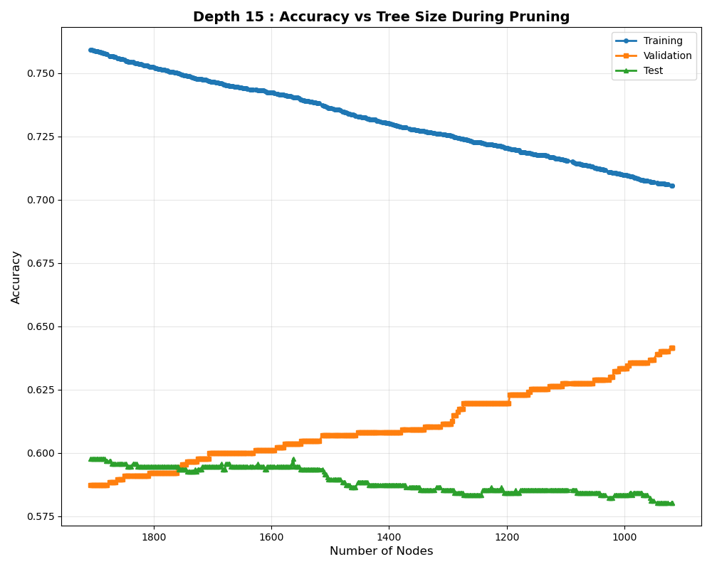
  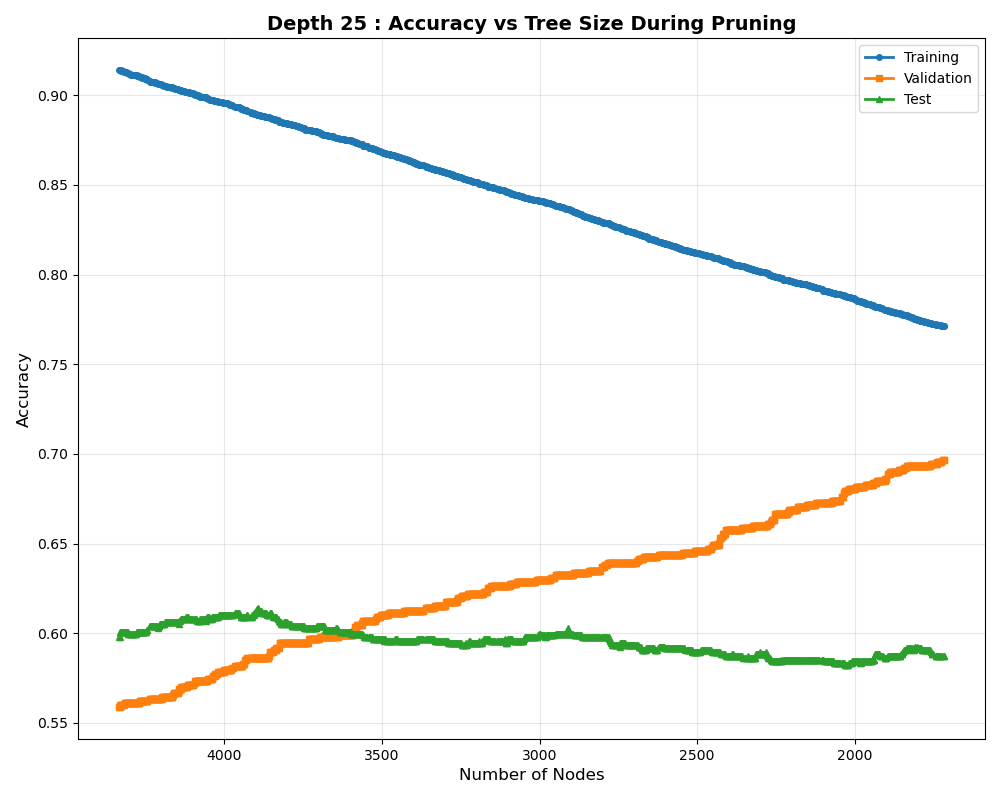
  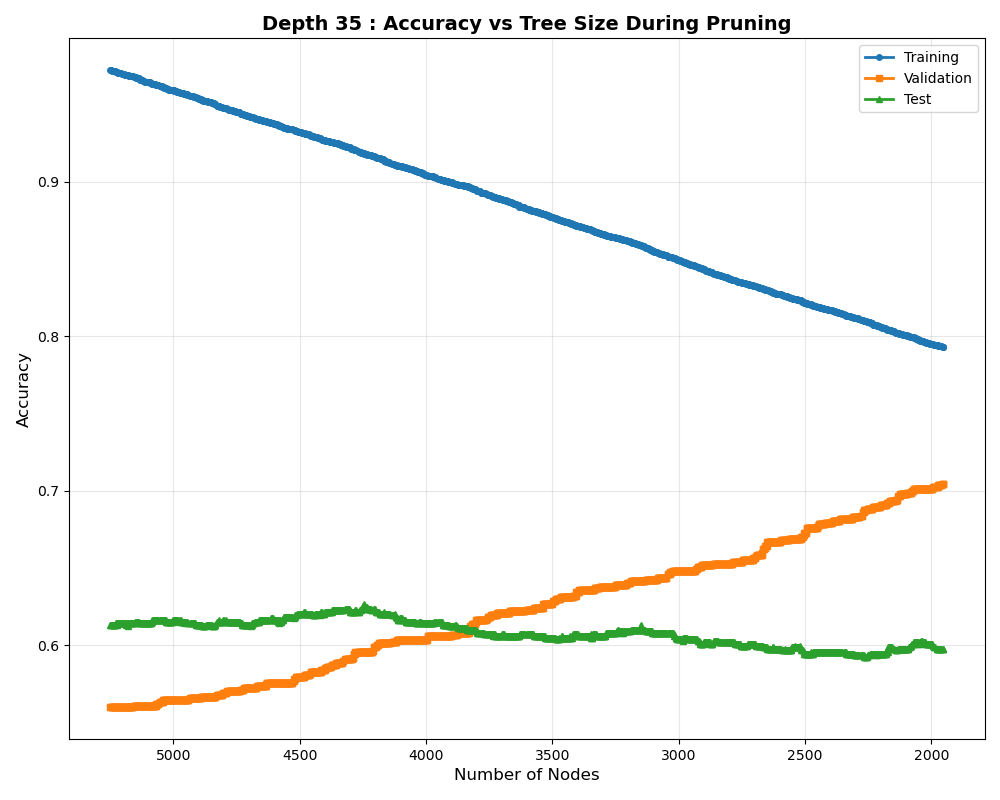
  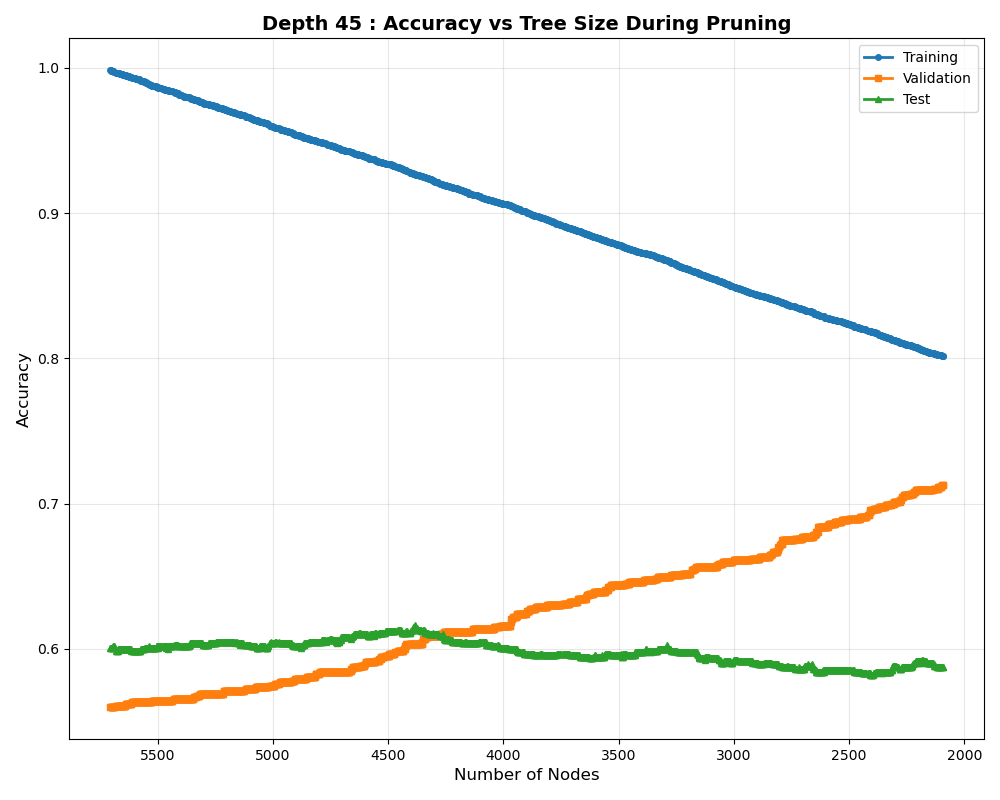

<b>Figure 3:</b> Training, validation, and test set accuracies against the number of nodes while successively pruning for different maximum depths with gini impurity.

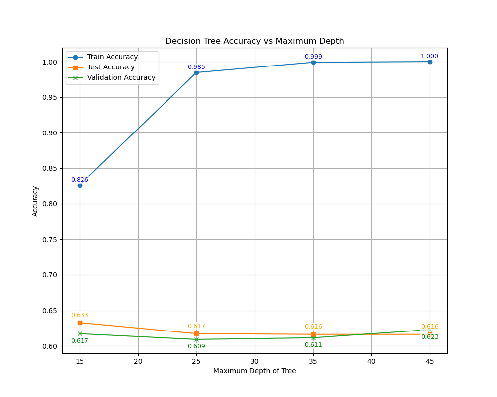

<b>Figure 4:</b> training, validation and test set accuracies against max depth for Decision Tree sci-kit learn. 

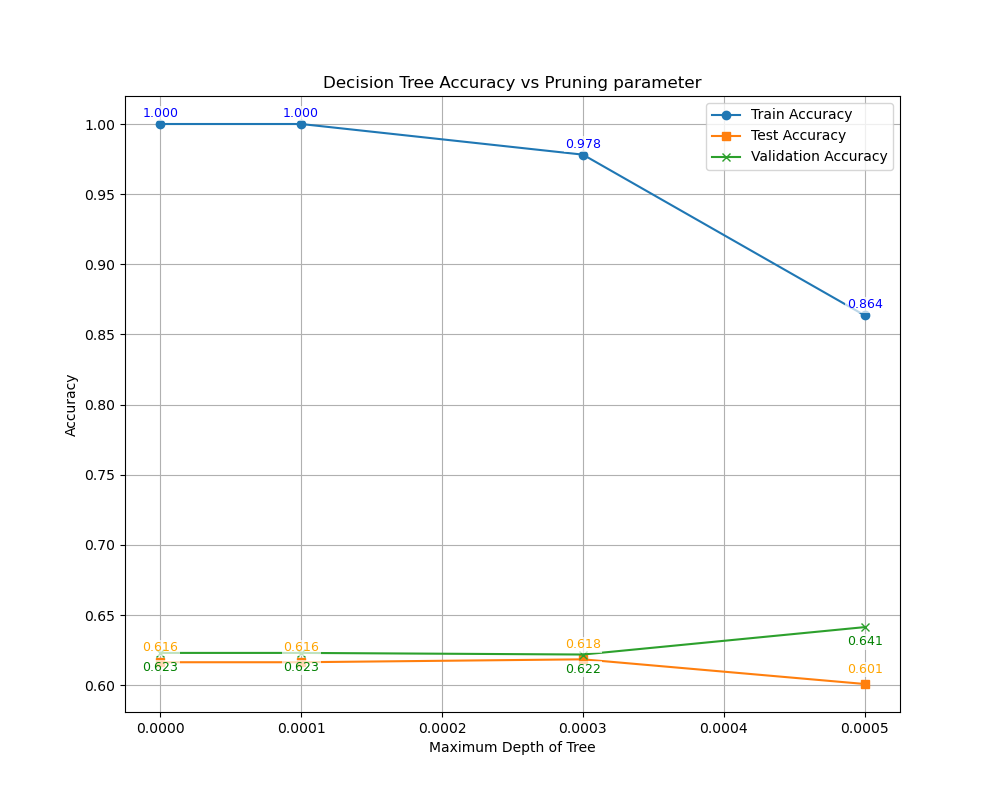

<b>Figure 4:</b> raining, validation and test set accuracies vs ccp alphas for Decision Tree sci-kit learn. 

### Neural Networks

<b>Figure 5:</b> F1 Score vs number of hidden units. 

<b>Figure 5:</b> average f1 score vs depth. 

<b>Figure 5:</b> average f1 score vs depth. 

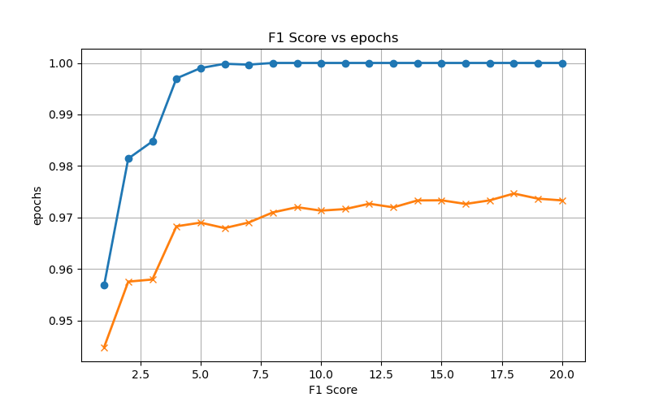

<b>Figure 5:</b> average f1 score vs depth. 

